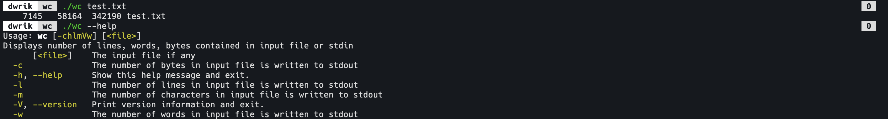

# wc

## Description

This is a `Java` implementation of the Unix core tool `wc`.



The cli has been implemented using [picocli](https://picocli.info/) and native executable has been generated using [GraalVM](https://www.graalvm.org/). The executable is an `arm64` binary compiled on an M1 Macbook Air 2020.

The binary generated is standalone i.e. everything required to run it is packaged into it. No java installation (jre, jdk, etc.) is necessary thanks to _GraalVM native-image_. The binary can be executed just like any other by simply invoking it on the command line:

```
>>> ./wc test.txt
    7145   58164  342190 test.txt
```

## Features

- line count
- word count
- byte count
- char count
- input from file
- input from stdin (compatible with pipes)

## Todo

- [ ] input from multiple files
